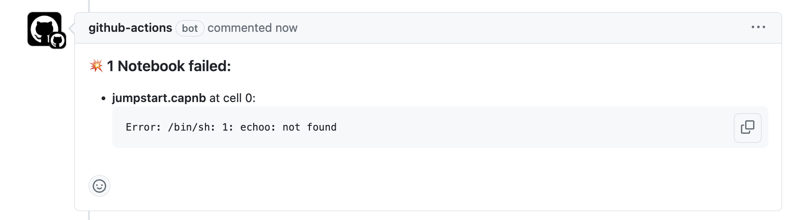
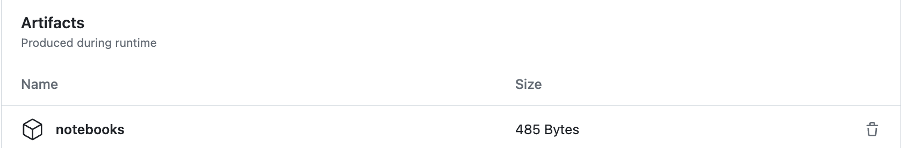
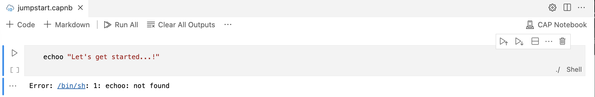

# *Notebook Runner* Action

This action automatically runs your Notebooks in [VS Code](https://code.visualstudio.com/) to check for errors, so that you don't have to.

If you register this action on a pull request, it will notify you in case of any errors (i.e. Notebooks with a failed code cell) with the error details:

  <picture>
    <source media="(prefers-color-scheme: dark)" srcset="./_assets/PR_comment_dark.png">
    
  </picture>

It also uploads the executed Notebooks themselves (_notebooks.zip_) as artifacts to the Actions summary:

  <picture>
    <source media="(prefers-color-scheme: dark)" srcset="./_assets/Artifacts_dark.png">
    
  </picture>

In some cases, further inspection on what went wrong in a Notebook might be necessary. Here, it can be of great value to unpack the above artifacts and taking
a close look at the Notebook by opening it in your local [VS Code](https://code.visualstudio.com/) Editor:

<picture>
  <source media="(prefers-color-scheme: dark)" srcset="./_assets/Notebook_dark.png">
  
</picture>

## Requirements

This action is a [composite action](https://docs.github.com/en/actions/creating-actions/creating-a-composite-action) that requires an *image* which includes `xvfb`.

The only required *inputs* are a string of `notebook-files` to test.

> [!WARNING]  
> This action does not check the **contents** of the input notebooks. It is recommended to only run notebooks from trusted sources.

| Name | Description | Required | Default |
| --- | --- | :---: | ---- |
| `notebook-files` | Notebooks to be tested, separated by spaces | ✓ ||
| `notebook-file-ext` | Notebook file extension | | `capnb` |
| `notebook-vscode-ext` | VS Code Notebook extension to install | | `SAPSE.vscode-cds` |
| `timeout` | Mocha timeout for VS Code tests | | `120000` |

<!--
| `vscode-version` | VS Code version to use | | `stable` |
| `artifacts-on-success` | Upload artifacts on success | | `false` |
| `artifacts-kind` | Copy folder to be uploaded as artifacts | | `file` |
-->

## Example usage

Below is an example which shows how to use this action to test 2 sample [CAP Notebooks](https://cap.cloud.sap/docs/tools/#cap-vscode-notebook), which you can also find in this repository under the [_test_](https://github.com/mnkiefer/notebook-runner/tree/main/test) directory:

```yaml
container:
  # docker image containing xvfb
  image: sitespeedio/sitespeed.io

steps:
- name: Test CAP Notebooks
  uses: mnkiefer/notebook-runner@main
    with:
      notebook-files: "./test/hello-world.capnb ./test/jumpstart.capnb"
```
